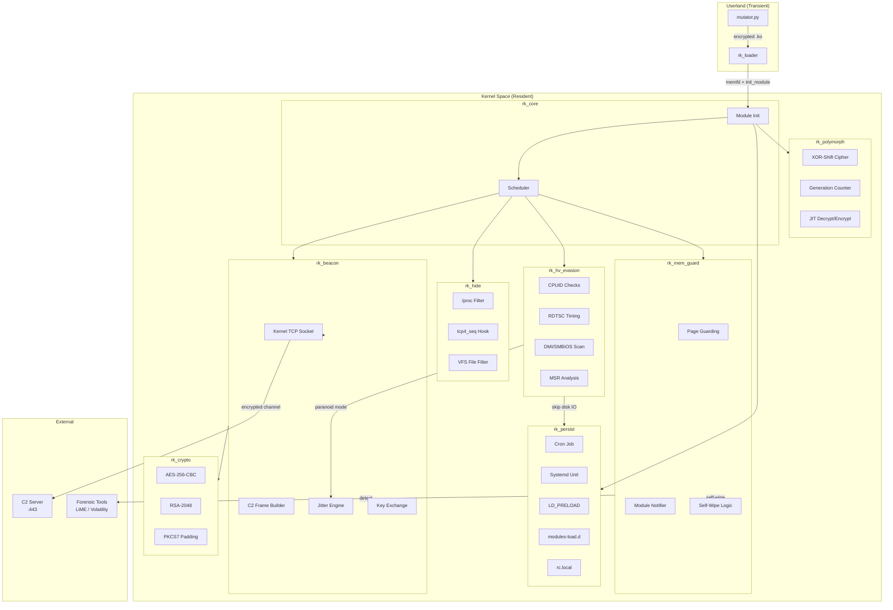
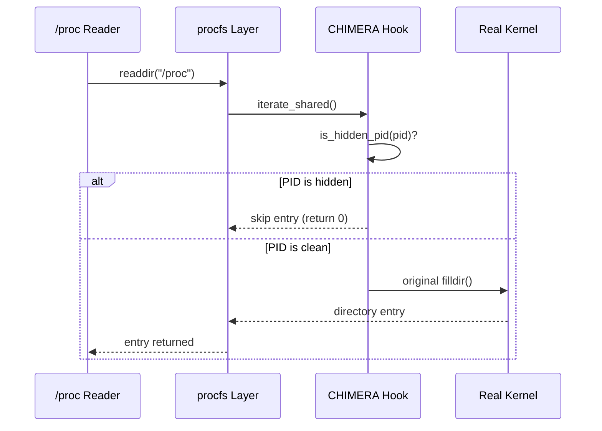
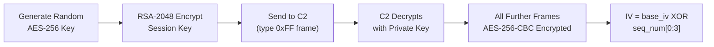
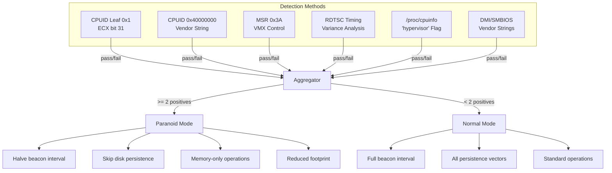
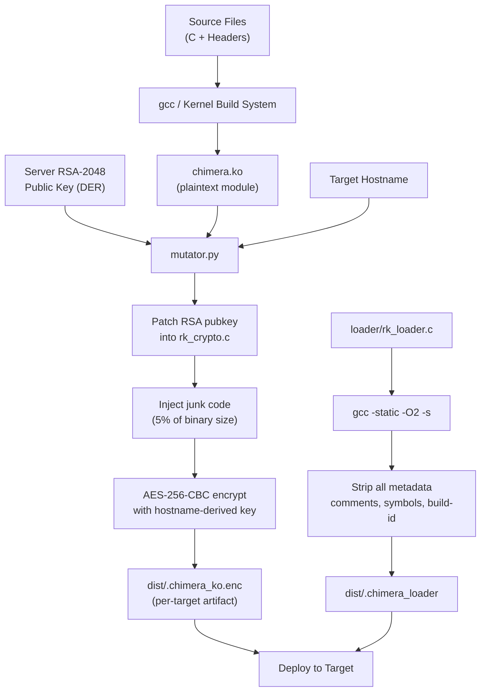
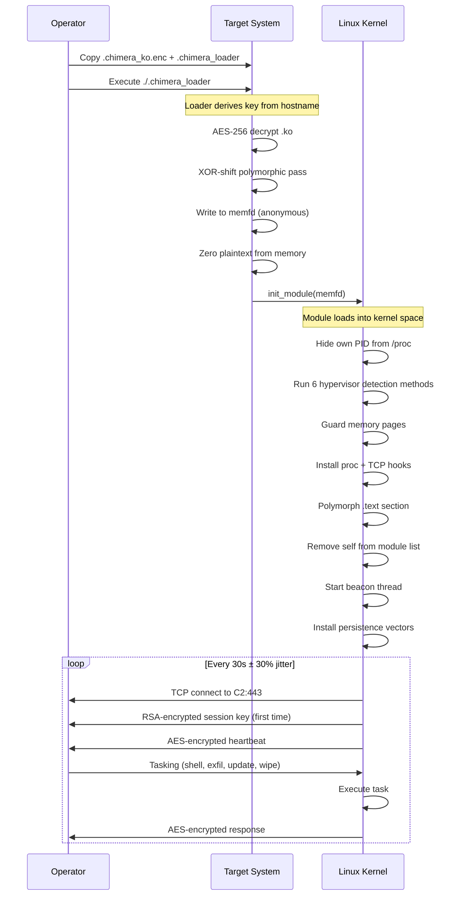

#  CHIMERA


  > Advanced Linux Rootkit Framework</strong><br>
  > Kernel-space persistence, encrypted C2, hypervisor evasion, polymorphic code mutation

---

## Table of Contents

- [Overview](#overview)
- [Architecture](#architecture)
- [Component Breakdown](#component-breakdown)
- [Build Pipeline](#build-pipeline)
- [Deployment Flow](#deployment-flow)
- [C2 Protocol](#c2-protocol)
- [Evasion Techniques](#evasion-techniques)
- [Build Instructions](#build-instructions)
- [Configuration Reference](#configuration-reference)
- [Threat Model](#threat-model)

---

## Overview

CHIMERA is a loadable kernel module (LKM) designed as a research artifact for studying advanced offensive rootkit techniques on Linux x86_64 systems. The project implements kernel-only C2 communications, multi-layer hypervisor detection, runtime polymorphic code mutation and automated persistence across five independent vectors.

Every component operates entirely in kernel space after initial load. No userspace daemon or binary remains resident post-exploitation.

> **Research Only.** This project exists to document and study offensive techniques for defensive purposes. Unauthorized deployment on systems you do not own is illegal.

---

## Architecture



---

## Component Breakdown

### Core Module

| File | Responsibility |
|------|---------------|
| `rk_core.c` | Module entry/exit, initialization orchestration, module list removal |
| `chimera.h` | Shared type definitions, constants, global state struct, function prototypes |

### Stealth Subsystem

| File | Responsibility |
|------|---------------|
| `rk_hide.c` | Process hiding via proc_ops replacement, TCP connection hiding via seq_ops hook, file path filtering |

Process hiding does **not** modify the syscall table. Instead it replaces function pointers inside the proc filesystem's internal `proc_ops` structures. EDR integrity monitors that watch `sys_call_table` for pointer modification see no changes.



### Cryptography

| File | Responsibility |
|------|---------------|
| `rk_crypto.c` | AES-256-CBC payload encryption via kernel crypto API, RSA-2048 session key exchange, PKCS7 padding, per-frame IV derivation |

Session keys are generated at connect time, encrypted with the server's RSA-2048 public key and transmitted once. All subsequent traffic uses AES-256-CBC with IVs derived by XORing the base IV with the frame sequence number. Keys exist only in kernel memory and are zeroed on teardown.



### C2 Beacon

| File | Responsibility |
|------|---------------|
| `rk_beacon.c` | Kernel TCP socket management, beacon loop with jittered timing, heartbeat system info collection, task execution dispatcher, exponential backoff on failure |

### Hypervisor Evasion

| File | Responsibility |
|------|---------------|
| `rk_hv_evasion.c` | Six independent detection methods (CPUID leaf 0x1, CPUID hypervisor vendor, MSR VMX control, RDTSC timing variance, /proc/cpuinfo flag, DMI/SMBIOS strings) |

Detection requires confirmation from at least two methods to avoid false positives. When a hypervisor is confirmed the module enters paranoid mode: beacon intervals halve, disk-based persistence is skipped and all operations go memory-only.



### Memory Protection

| File | Responsibility |
|------|---------------|
| `rk_mem_guard.c` | Module page reservation, kernel module load notifier for forensic tool detection, automatic self-wipe on forensic module detection |

The module registers a notifier on the kernel's module load chain. When a module with a name matching known forensic tools (LiME, Volatility memory dumpers, FTK, Rekall) loads, CHIMERA immediately zeroes all keys, restores original hooks and marks its own pages as reserved to prevent coherent memory reads.

### Polymorphic Engine

| File | Responsibility |
|------|---------------|
| `rk_polymorph.c` | Runtime XOR-shift cipher over the module's .text section, generation counter for unique mutations per deployment, JIT decrypt/encrypt wrappers for hooked functions |

The polymorphic engine operates at two levels:

1. **Build time**: `mutator.py` injects junk code, generates per-target encryption keys derived from hostname hashes and produces a unique encrypted artifact
2. **Runtime**: After module init, the .text section is XOR-shift encrypted in memory. Hooked functions decrypt their code region before execution and re-encrypt on return. The C2 server can push new keys to trigger re-polymorphism without reloading

### Persistence

| File | Responsibility |
|------|---------------|
| `rk_persist.c` | Five independent persistence vectors: cron job, systemd unit, LD_PRELOAD, modules-load.d, rc.local |

All writes go through kernel VFS. No userspace shell commands are spawned. Each vector is independent so removal of any single one does not kill the implant.

---

## Build Pipeline



---

## Deployment Flow



---

## C2 Protocol

All communication uses a custom framing protocol over raw TCP.

### Frame Structure

| Offset | Size | Field | Description |
|--------|------|-------|-------------|
| 0 | 4 | `magic` | `0xCH1M3RA` in network byte order |
| 4 | 4 | `seq` | Monotonic sequence number |
| 8 | 2 | `type` | Task type identifier |
| 10 | 2 | `length` | Encrypted payload length |
| 12 | variable | `payload` | AES-256-CBC encrypted, PKCS7 padded |

The header is transmitted in plaintext for framing purposes. All sensitive data lives in the encrypted payload. The sequence number is incorporated into IV derivation so identical payloads produce different ciphertexts.

### Task Types

| Type | Hex | Direction | Description |
|------|-----|-----------|-------------|
| HEARTBEAT | `0x01` | Outbound | System fingerprint (hostname, uptime, PID, HV status) |
| SHELL | `0x02` | Inbound | Execute command via call_usermodehelper |
| EXFIL | `0x03` | Inbound | Read and exfiltrate file contents |
| PERSIST | `0x04` | Inbound | Reinstall all persistence vectors |
| UPDATE | `0x05` | Inbound | New polymorphic key + generation counter |
| WIPE | `0x06` | Inbound | Self-destruct: zero keys, unhook, unmap |
| KEY_EXCHANGE | `0xFF` | Outbound | RSA-encrypted AES session key (first frame) |

### Heartbeat TLV Format

```
[type:1][len:1][value:N] [type:1][len:1][value:N] ...
```

| Type ID | Content |
|---------|---------|
| `0x01` | Hostname (null-terminated string) |
| `0x02` | Uptime (4 bytes, little-endian seconds) |
| `0x03` | Module PID (4 bytes, little-endian) |
| `0x04` | Hypervisor detected (1 byte, 0 or 1) |

---

## Evasion Techniques

<details>
<summary><strong>Syscall Table Independence</strong></summary>

Most EDR products and kernel integrity modules monitor `sys_call_table` by hashing pointer values at load time and comparing periodically. CHIMERA never touches the syscall table. Process hiding replaces `proc_ops.iterate_shared` on the proc filesystem's internal structures. Network hiding replaces `seq_ops.show` on the tcp4 proc entry. Both modifications are invisible to syscall-table monitors.

</details>

<details>
<summary><strong>Module List Removal</strong></summary>

After initialization the module calls `list_del_init(&THIS_MODULE->list)` which unlinks the module struct from the kernel's loaded module list. Tools like `lsmod`, `cat /proc/modules` and `modinfo` enumerate this list and will not see CHIMERA. The module remains loaded and functional because the kernel holds its reference count.

</details>

<details>
<summary><strong>memfd Loading</strong></summary>

The userspace loader writes the decrypted module to an anonymous in-memory file descriptor created via `memfd_create()`. The kernel's `init_module()` syscall reads from this fd. The .ko plaintext never exists on disk. After loading the memfd is closed and all plaintext buffers are zeroed.

</details>

<details>
<summary><strong>Per-Target Binary Uniqueness</strong></summary>

Each build produces a cryptographically unique artifact. The deployment AES key is derived from a SHA-256 hash of the target hostname. Build-time junk code injection adds 5% random bytes. Runtime XOR-shift mutation ensures the in-memory .text section never matches the on-disk (encrypted) form or any other deployment's memory layout.

</details>

<details>
<summary><strong>Anti-Forensic Self-Wipe</strong></summary>

A notifier registered on the kernel's module load chain watches for forensic tool signatures. When detected the module zeroes all cryptographic keys, restores original hook pointers and marks its pages as reserved to block coherent physical memory access. This happens before the forensic module completes initialization.

</details>

---

## Build Instructions

### Prerequisites

| Requirement | Version |
|-------------|---------|
| Linux kernel headers | 5.x or 6.x (tested on 6.1) |
| GCC | 11+ |
| Python | 3.9+ |
| OpenSSL (for loader) | 3.0+ |
| cryptography (Python) | 41.0+ |

### Step 1: Generate RSA Keypair

```bash
mkdir -p keys
openssl genrsa -out keys/server_priv.pem 2048
openssl rsa -in keys/server_priv.pem -pubout -outform DER -out keys/server_pub.der
```

### Step 2: Build the Kernel Module

```bash
make all
```

### Step 3: Build Target Artifact

```bash
make mutate TARGET=webserver01 RSA_PUB=keys/server_pub.der
```

This produces two files in `dist/`:

| File | Purpose |
|------|---------|
| `.chimera_ko.enc` | AES-encrypted kernel module (unique to target) |
| `.chimera_loader` | Static userspace loader (stripped, no metadata) |

### Step 4: Deploy

```bash
scp dist/.chimera_ko.enc dist/.chimera_loader root@target:/tmp/
ssh root@target "cd /tmp && ./.chimera_loader"
```

### Clean Build

```bash
make clean
```

---

## Configuration Reference

All configuration lives in `include/chimera.h`.

| Constant | Default | Description |
|----------|---------|-------------|
| `C2_HOST` | `"192.168.1.100"` | C2 server IP address |
| `C2_PORT` | `443` | C2 server TCP port |
| `BEACON_BASE_MS` | `30000` | Base beacon interval in milliseconds |
| `BEACON_JITTER_PCT` | `0.30` | Random jitter as fraction of base (0.30 = 30%) |
| `AES_KEY_SIZE` | `32` | AES key length in bytes (256-bit) |
| `RSA_KEY_SIZE` | `256` | RSA key length in bytes (2048-bit) |
| `MAX_HIDDEN` | `256` | Maximum number of hidden PIDs |
| `RDTSC_SAMPLES` | `100` | Number of RDTSC timing samples |
| `RDTSC_THRESHOLD` | `500` | Cycle threshold for VM exit spike detection |

---

## Threat Model

### What CHIMERA Defends Against

| Defender | Technique CHIMERA Uses |
|----------|----------------------|
| Syscall table monitors | No syscall table modification |
| lsmod / modinfo | Module list unlinking |
| /proc scanning | proc_ops replacement |
| netstat / ss | tcp4 seq_ops hook |
| YARA memory scans | Runtime polymorphic .text encryption |
| Disk forensics | memfd loading, no plaintext on disk |
| LiME / Volatility | Module load notifier with automatic self-wipe |
| Timing-based beacon detection | Jittered sleep (30% randomization) |
| Hypervisor introspection | Six-method HV detection with paranoid mode |
| Integrity checkers | Page reservation, per-target unique binaries |

### What CHIMERA Does Not Defend Against

| Defender | Why |
|----------|-----|
| Kernel address space layout randomization (KASLR) bypass | Not implemented; assumes KASLR already bypassed at load time |
| eBPF-based monitoring | eBPF programs can observe socket creation and module loading events |
| Kernel runtime integrity (like kernel lockdown) | Kernel lockdown mode blocks unsigned module loading entirely |
| Hardware-based attestation (TPM, measured boot) | TPM PCRs would detect unsigned kernel modifications |
| Live response teams with custom kernel modules | A sufficiently novel forensic module would bypass the name-based notifier |

---

